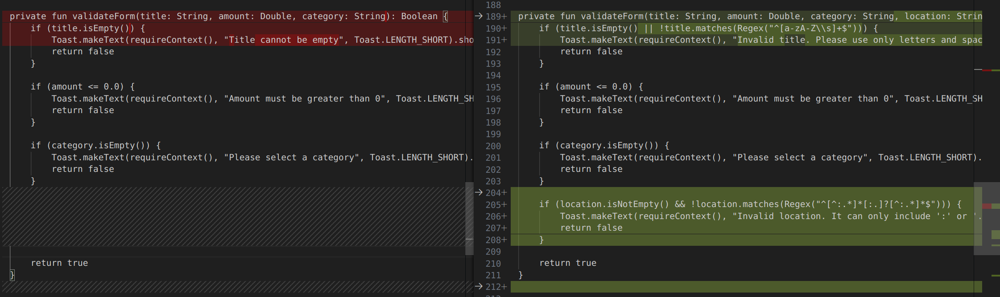

# BondoMan
The BondoMan app is an Android application for financial tracking, made using kotlin. Start taking charge of your own financial independence now!

## 🔥 Features
- Adding, editing, and deleting transactions
- Viewing transaction history
- Scanning receipts
- Viewing transaction summary graphs
- Exporting transaction data into XLS/XLSX format
- Sending transaction data via email
- Randomizing transactions
- Network connectivity sensing
- JWT Login & Expiry check using background service

## ⚠️ Dependencies and Libraries
- AndroidX Core KTX
- AndroidX AppCompat
- AndroidX ConstraintLayout
- AndroidX Lifecycle LiveData KTX
- AndroidX Lifecycle ViewModel KTX
- AndroidX Navigation Fragment KTX
- AndroidX Navigation UI KTX
- Retrofit
- Retrofit Converter Gson
- OkHttp
- Gson
- AndroidX Test Core KTX
- AndroidX Work Runtime KTX
- Kotlinx Coroutines Android
- Kotlinx Coroutines Core
- Ktor Client Android
- Ktor Client Serialization
- AndroidX Security Crypto
- Google Play Services Location
- AndroidX CardView
- Robolectric
- Mockito Core
- JUnit
- AndroidX Test JUnit
- AndroidX Test Espresso Core
- AndroidX Camera Camera2
- AndroidX Camera Lifecycle
- AndroidX Camera View
- AndroidX Room KTX
- AndroidX Room Compiler (Annotation Processor and KAPT)
- Apache POI
- Apache POI OOXML
- XMLBeans
- MPAndroidChart

## 🖥️ Screenshots
- Loading Screen

- Login Screen

- Transaction List

- Add/Edit Transaction

- Bar Chart

- Pie Chart

- Scan Bill

- Settings

- Email, XLSX

- [BONUS] Twibbon

## 🔐 OWASP Analysis
Ada tiga kerentanan yang akan dianalisis yakni M4, M8, dan M9 (2024). Masing-masing kerentanan tersebut adalah M4: Insufficient Input/Output Validation, M8: Security Misconfig, dan M9: Insecure Data Storage

1. M4: Insufficient Input/Output Validation

Biasanya hal ini terjadi karena validasi dan sanitasi data dari pengguna yang tidak tepat sehingga dapat menimbulkan serangan seperti SQL Injection, Command Injection ataupun Cross-Site Scripting (XSS) attack.

Analisis dan Perbaikan

Pada aplikasi kami sebelumnya hanya melakukan validasi untuk tipe datanya saja misalnya amount harus lebih dari nol atau semacamnya, tetapi untuk menghindari SQL Injection dan semacamnya kami melakukan validasi tambahan, yakni menggunakan regex di mana title hanya boleh dalam bentuk karakter dan location boleh karakter tetapi selain alfabet dan "." dan ":" tidak diperbolehkan. Berikut adalah perbedaannya setelah diperbaiki.

2. M8: Security Misconfiguration

Beberapa eksploit yang biasa digunakan untuk masalah M8 adalah sebagai berikut:
* Unnecessary permissions enabled
* Weak encryption or hashing
* Lack of secure communication
* Insecure file permissions
* Improper session management

Analisis dan Perbaikan

Berikut adalah daftar permission yang digunakan pada aplikasi kami: Internet, Camera, Write External Storage, Manage External Storage, Read External Storage, Access Network State, Access WIFI State, Access Fine Location, Access Coarse Location, Access Background Location. Menurut kami apa yang kami gunakan sebagai permission untuk aplikasi ini sudah sesuai sehingga tidak ada unnecessary permission yang kami gunakan. Untuk enkripsi yang kami gunakan terdapat pada EncryptedSharedPreferences di mana kami menyimpan token dan data-data dari JWT claimnya di dalam wadah tersebut di mana wadah tersebut dienkripsi menggunakan algoritma AES 256. Untuk secure communication, semua perantaraan antara aplikasi dan backend menggunakan HTTPS (dari servernya) jadi pesan yang dikirimkan ke server sudah secure pada layer TLS. Selain itu, untuk session management yang kami gunakan sudah cukup baik di mana kami akan melakukan check setiap 2 menit untuk token yang disimpan pada aplikasi jika sudah expired maka akan dilogout secara otomatis serta jika akan melakukan request ke server menggunakan token yang expired maka tidak akan ada hal yang terjadi karena response ditolak.

3. M9: Insecure Data Storage
Biasanya kerentanan ini dapat dieskploit dengan adanya akses kontrol yang tidak baik sehingga orang lain atau agen dapat mengakses informasi sensitif. Eksploit yang digunakan adalah:
* Enkripsi yang lemah
* Tidak ada proteksi data storage (persistent)
* Handling user credentials yang tidak benar

Analisis dan Perbaikan

Dalam hal ini beberapa hal yang telah kami lakukan untuk menjaga data dari pengguna adalah dengan menggunakan EncryptedSharedPreferences di mana token dan data yang diekstrak dari JWT disimpan. EncryptedSharedPreferences menggunakan enkripsi AES 256 bit yang dinilai cukup kuat untuk mengengkripsi data-data tersebut. Untuk metode penyimpanan menggunakan SQL Lite ada beberapa alternatif yang dapat digunakan untuk menjaga data di dalamnya, yakni melakukan enkripsi pada persistence tersebut atau menggunakan alternatif lain yakni online storage. Selain itu, melakukan enkripsi kepada storage SQL Lite dapat dipertimbangkan tetapi akan menambah overhead pada sistem karena setiap pembacaan data harus dilakukan proses enkripsi dan dekripsi sehingga masih harus dipertimbangkan untuk mendapatkan keamanan data dan overhead yang timbul jika menggunakan opsi ini.

## 📱 Accesibility Testing
...

## 🖥️ **Workload Distribution and Contributors**
| Name                     | Student ID | Functionality | Work Duration |
|--------------------------|------------|---------------|-------|
| Juan Christopher Santoso | 13521116   | <ul> <li> Bill Scanner </li> <li> Graph Transaction History</li> <li> Randomize Transaction Receiver </li><li> UI & Animation </li>  </ul>              | 40 jam|
| William Nixon            | 13521123   | <ul>  <li> Trx Manipulation, List </li> <li> Saving Trx into XLS/XLSX </li> <li> Intent Gmail </li> <li> Network Sensing </li> </ul>             | 40 jam |
| Nicholas Liem            | 13521135   | <ul> <li> Header and Navbar </li> <li> Login </li> <li> Logout </li> <li> Manipulasi trx (location service) </li> <li> Background service </li> <li> Intent to Gmaps </li> <li> UI & Animation </li> </ul>            | 40 jam|
