# BondoMan
The BondoMan app is an Android application for financial tracking, made using kotlin. Start taking charge of your own financial independence now!

## 🔥 Features
- Adding, editing, and deleting transactions
- Viewing transaction history
- Scanning receipts
- Viewing transaction summary graphs
- Exporting transaction data into XLS/XLSX format
- Sending transaction data via email
- Randomizing transactions
- Network connectivity sensing
- JWT Login & Expiry check using background service

## ⚠️ Dependencies and Libraries
- AndroidX Core KTX
- AndroidX AppCompat
- AndroidX ConstraintLayout
- AndroidX Lifecycle LiveData KTX
- AndroidX Lifecycle ViewModel KTX
- AndroidX Navigation Fragment KTX
- AndroidX Navigation UI KTX
- Retrofit
- Retrofit Converter Gson
- OkHttp
- Gson
- AndroidX Test Core KTX
- AndroidX Work Runtime KTX
- Kotlinx Coroutines Android
- Kotlinx Coroutines Core
- Ktor Client Android
- Ktor Client Serialization
- AndroidX Security Crypto
- Google Play Services Location
- AndroidX CardView
- Robolectric
- Mockito Core
- JUnit
- AndroidX Test JUnit
- AndroidX Test Espresso Core
- AndroidX Camera Camera2
- AndroidX Camera Lifecycle
- AndroidX Camera View
- AndroidX Room KTX
- AndroidX Room Compiler (Annotation Processor and KAPT)
- Apache POI
- Apache POI OOXML
- XMLBeans
- MPAndroidChart

## 🖥️ Screenshots
- Loading Screen
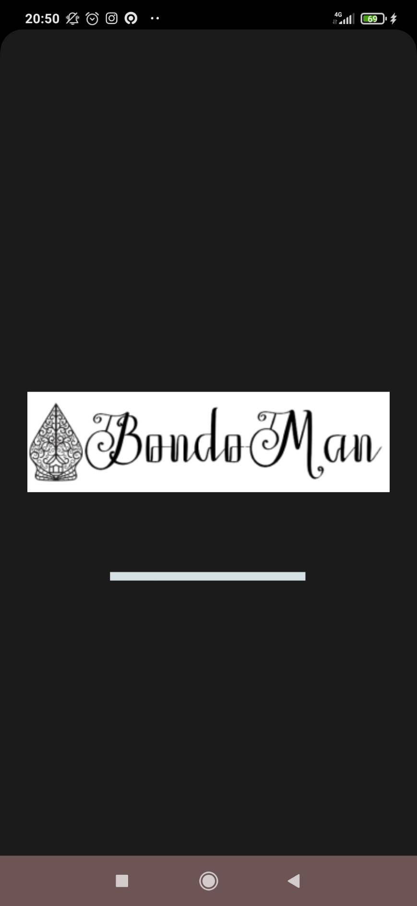
- Login Screen
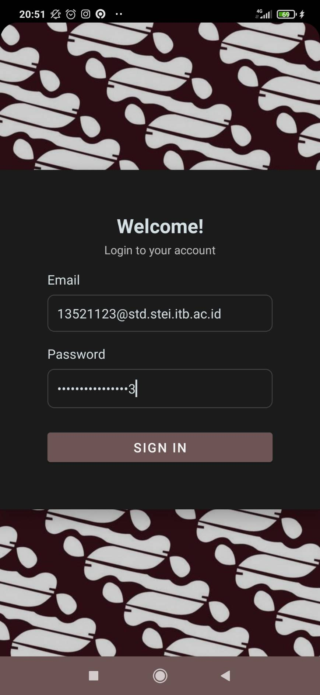
- Transaction List
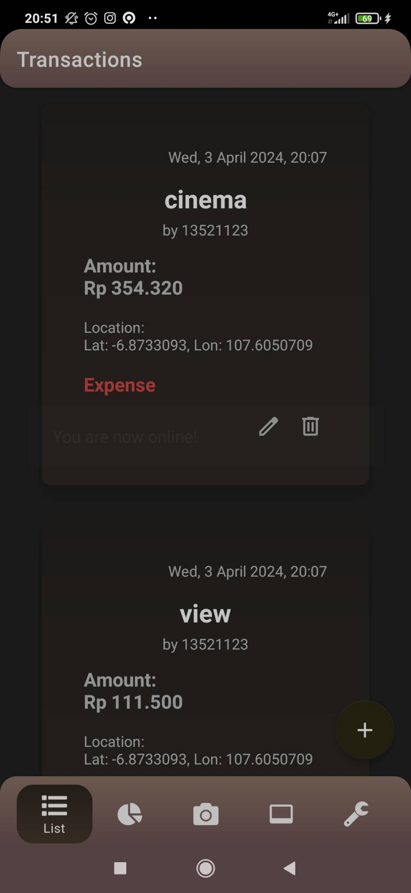
- Add/Edit Transaction
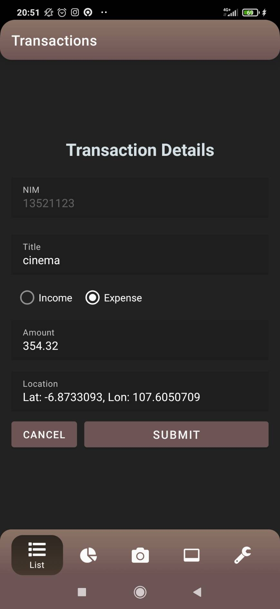
- Bar Chart
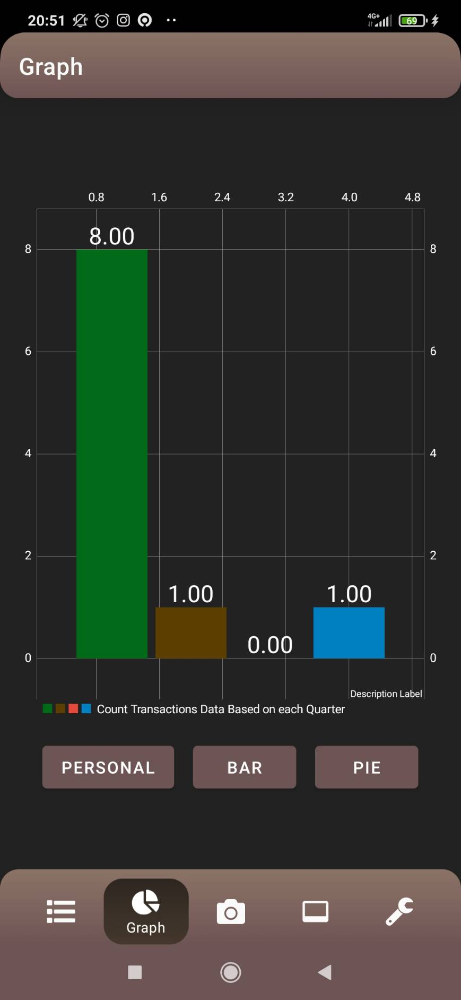
- Pie Chart
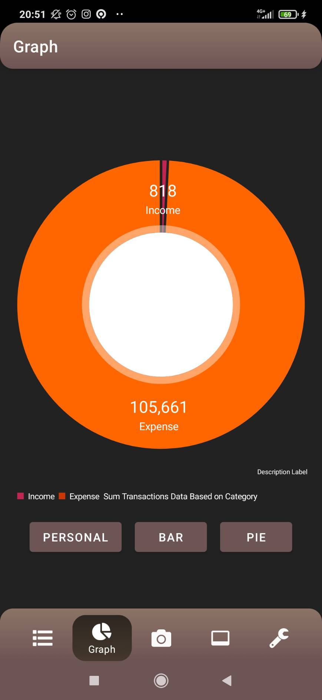
- Scan Bill
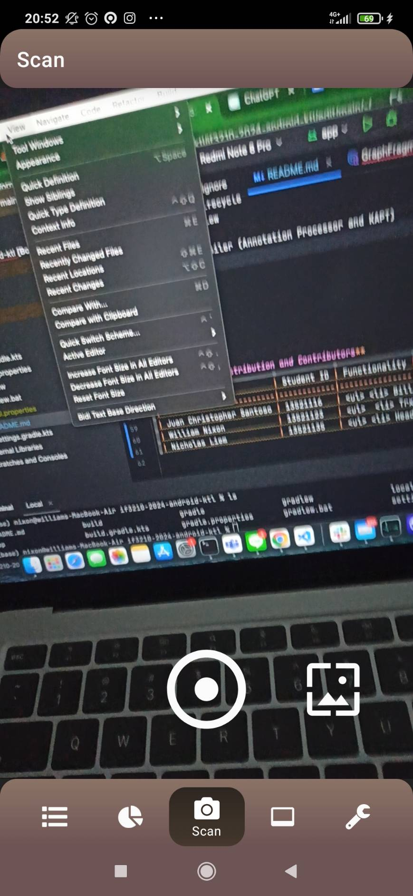
- Settings
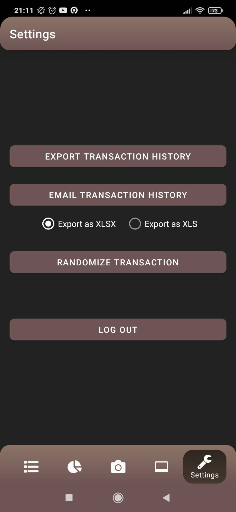
- Email, XLSX
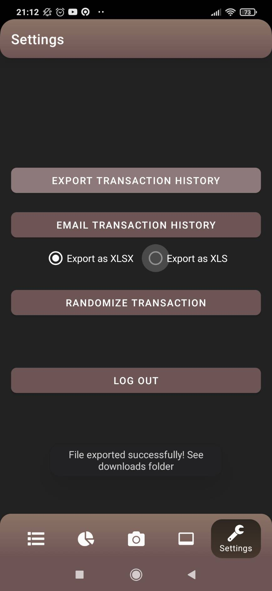
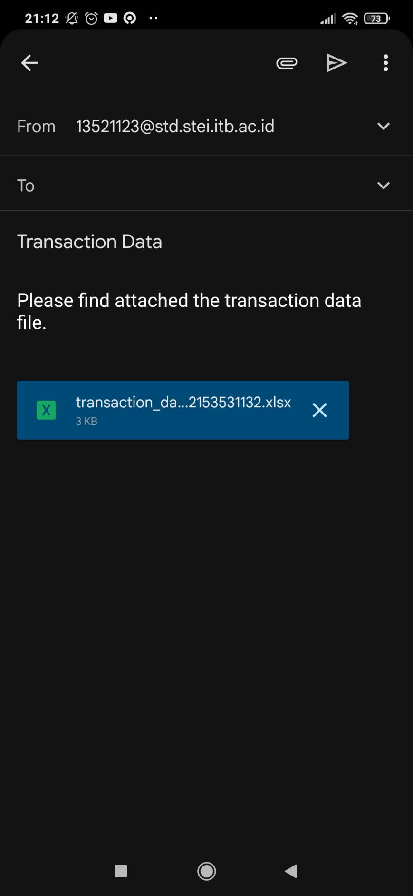
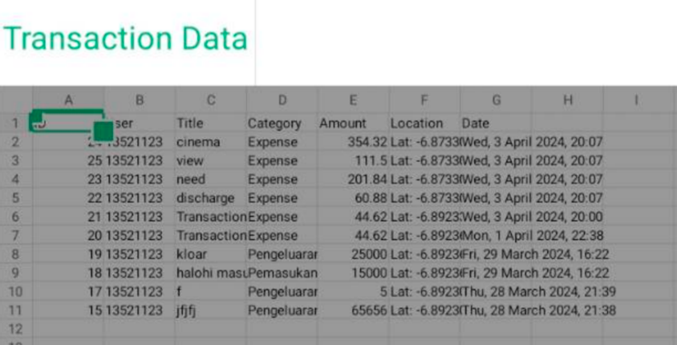
- [BONUS] Twibbon
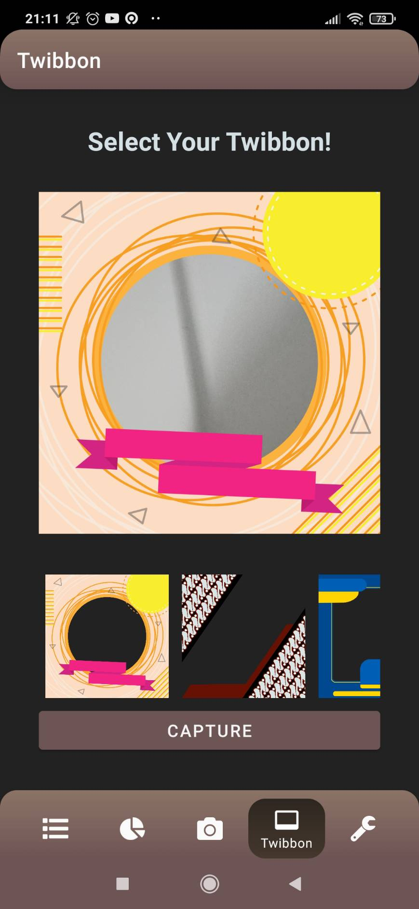
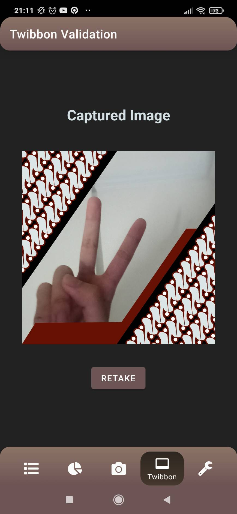

## 🔐 OWASP Analysis
Ada tiga kerentanan yang akan dianalisis yakni M4, M8, dan M9 (2024). Masing-masing kerentanan tersebut adalah M4: Insufficient Input/Output Validation, M8: Security Misconfig, dan M9: Insecure Data Storage

1. M4: Insufficient Input/Output Validation
Biasanya hal ini terjadi karena validasi dan sanitasi data dari pengguna yang tidak tepat sehingga dapat menimbulkan serangan seperti SQL Injection, Command Injection ataupun Cross-Site Scripting (XSS) attack.

Analisis dan Perbaikan

2. M8: Security Misconfiguration
Beberapa eksploit yang biasa digunakan untuk masalah M8 adalah sebagai berikut:
* Unnecessary permissions enabled
* Weak encryption or hashing
* Lack of secure communication
* Unprotected storage
* Insecure file permissions
* Improper session management

Analisis dan Perbaikan

3. M9: Insecure Data Storage
Biasanya kerentanan ini dapat dieskploit dengan adanya akses kontrol yang tidak baik sehingga orang lain atau agen dapat mengakses informasi sensitif. Eksploit yang digunakan adalah:
* Enkripsi yang lemah
* Tidak ada proteksi data storage (persistent)
* Handling user credentials yang tidak benar

Analisis dan Perbaikan

## 📱 Accesibility Testing
...

## 🖥️ **Workload Distribution and Contributors**
| Name                     | Student ID | Functionality | Work Duration |
|--------------------------|------------|---------------|-------|
| Juan Christopher Santoso | 13521116   | <ul> <li> Bill Scanner </li> <li> Graph Transaction History</li> <li> Randomize Transaction Receiver </li><li> UI & Animation </li>  </ul>              | 40 jam|
| William Nixon            | 13521123   | <ul>  <li> Trx Manipulation, List </li> <li> Saving Trx into XLS/XLSX </li> <li> Intent Gmail </li> <li> Network Sensing </li> </ul>             | 40 jam |
| Nicholas Liem            | 13521135   | <ul> <li> Header and Navbar </li> <li> Login </li> <li> Logout </li> <li> Manipulasi trx (location service) </li> <li> Background service </li> <li> Intent to Gmaps </li> <li> UI & Animation </li> </ul>            | 40 jam|
